# Table of contents
- [Table of contents](#table-of-contents)
- [Ansible architecture](#ansible-architecture)
- [Background research](#background-research)
- [Create a EC2 instance for "controller" node](#create-a-ec2-instance-for-controller-node)
  - [Host files](#host-files)
  - [Running ADHOC](#running-adhoc)
  - [Playbook - install nginx + config](#playbook---install-nginx--config)
- [Use ADHOC to copy to target node](#use-adhoc-to-copy-to-target-node)
- [Use a copy module](#use-a-copy-module)
- [Playbook - provision the APP VM](#playbook---provision-the-app-vm)
  - [To make your code more cloud agnostic](#to-make-your-code-more-cloud-agnostic)
  - [Using PM2 - for npm see further below](#using-pm2---for-npm-see-further-below)
    - [Task 1: install curl](#task-1-install-curl)
    - [Task 2: add the source for nodejs](#task-2-add-the-source-for-nodejs)
    - [Task 3: install and configure nodejs](#task-3-install-and-configure-nodejs)
    - [Task 4: download pm2 to run in background (for pm2 run)](#task-4-download-pm2-to-run-in-background-for-pm2-run)
    - [Task 5: clone the app repo from github](#task-5-clone-the-app-repo-from-github)
    - [Task 6: install packages](#task-6-install-packages)
    - [Task 7: pm2 stop all and pm2 start](#task-7-pm2-stop-all-and-pm2-start)
  - [Complete NPM and PM2 scripts](#complete-npm-and-pm2-scripts)
- [Playbook - provision the DB VM](#playbook---provision-the-db-vm)
    - [Task 1: Mongodb public key](#task-1-mongodb-public-key)
    - [Task 2: Add Mongo DB repo](#task-2-add-mongo-db-repo)
    - [Task 3: installing Mongo DB](#task-3-installing-mongo-db)
    - [Task 4: start and enable mongo db](#task-4-start-and-enable-mongo-db)
    - [Task 5: change the Bind IP in the mongodb config file](#task-5-change-the-bind-ip-in-the-mongodb-config-file)
    - [Task 6: start and enable mongodb again](#task-6-start-and-enable-mongodb-again)
  - [Trouble shooting](#trouble-shooting)
- [Create a master playbook](#create-a-master-playbook)

# Ansible architecture
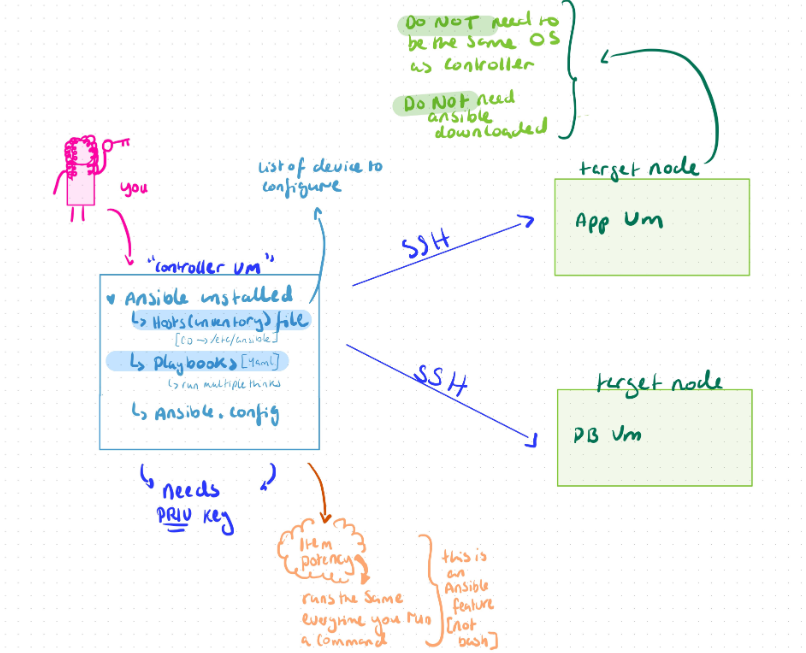
# Background research

**How Ansible Works:**
Ansible operates by connecting to your nodes (servers, cloud instances, network devices, etc.) via SSH (for Linux/Unix systems) or WinRM (for Windows systems) and executing tasks defined in playbooks. 

It uses an agent-less architecture, meaning you don’t need to install any software on the nodes it manages. 

**Key Concepts in Ansible:**

- Playbook: A YAML file where you define automation tasks and configurations. Playbooks describe a series of steps to bring systems to the desired state.

- Tasks: Individual actions within a playbook, such as installing software, configuring services, or modifying files.

- Inventory: A file or dynamic source where you define the hosts or nodes that Ansible will manage. The inventory can be static (a list of servers) or dynamic (generated from a cloud provider).

- Modules: Reusable units of code that perform actions such as installing software, managing files, or interacting with cloud providers. Ansible comes with many built-in modules for various tasks (e.g., managing users, services, and databases).

- Roles: A collection of tasks, files, variables, and handlers organized for reuse across different playbooks or projects.

- Handlers: Tasks that only run when notified by other tasks, usually to restart services after a configuration change.

- Facts: Information gathered about the target system (e.g., IP addresses, OS version) that can be used to make decisions in playbooks.

# Create a EC2 instance for "controller" node
1. create the EC2  instance for our controller vm (make sure it is the correct vm)
2. name it "tech264-anjy-ubuntu-2204-ansible-controller"
3. ssh into the vm
4. do a package update ```sudo apt update```
5. do a package upgrade```sudo DEBIAN_FRONTEND=noninteractive apt upgrade -y```
6. install ansible 
   1. we need our package manager to get the ansible repo ```sudo apt-add-repository ppa:ansible/ansible```
   2. run the package update again (good practice to get the most updated version) ```sudo apt update -y```
   3. next we install ```sudo apt install ansible -y```
   4. check the version ``ansible --version``
   5. it tells you information - including the path to the config file 
   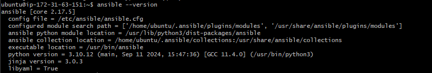
   6. cd into the ansible folder ``` cd /etc/ansible``` - useful to get to config files later
7. we need the PRIVATE aws key on the controller node
   1. go to home direc on your vm bash window
   2. cd into .ssh folder 
   3. open a new bash window 
   4. cd into the .ssh folder in your local machine - private key is .pem
   5. cat to display your .pem file and copy the EXACT contents 
   6. in your bash window for your controller vm 
   7. nano and create a file with the SAME name and paste the contents 
   8. remember to save and exit the file "ctrl + s" and "ctrl + x"
   9. check the key is there, for security only the first line ```head -1 "name of key"```
8.  our private key is now on our vm, we need to add permissions
    1.  on the aws page for the ec2 instance - you can see the command to make sure your ley is not publicly visible (400- only the owner can read)
    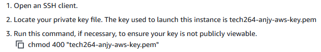
    2.  run the chmod command ```chmod 400 "tech264-anjy-aws-key.pem"```
    3.  confirm the permission have changed with ```ls -l``
   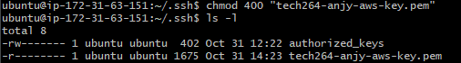

## Host files
9.  using the ping module- check your controller module can communicate to all the devices in your host file ```ansible all -m ping ```

1.  The host file is empty so we need to add our target nodes
2.  ```cd /etc/ansible``` 
3.  ``` ls``` you can see 3 files 
4.  we need permissions to write in the hosts file ``` sudo nano hosts``` 
5.  we need to add a group of device name it ``` [web]```
    1. to ping a group specifically replace "all" with "web"
6.  add the public ip address (we're already in the same vnet/vpc as the node so we don't need to use public ip but we need practice for the future).
    1.  to get ansible to configure itself ```localhost ansible_connection=local```
7.  add a label to the ip address
8.  add ```ansible_host=*node public ip address*```
9.  add ```ansible_user=ubuntu```
10. add ```private_key_key=~/.ssh/tech264-anjy-aws-key.pem```
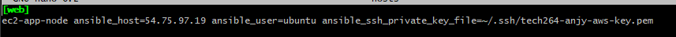
1.  save and exit
2.  run the ping again - say yes to connect

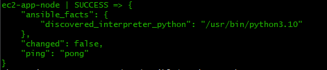

1. to create sub groups within our group
   1. nano back into the hosts file and create a parent group ``[test]``
   2. place ``[web]`` and ``[db]`` as subgroups - ```[test:children] web db```
   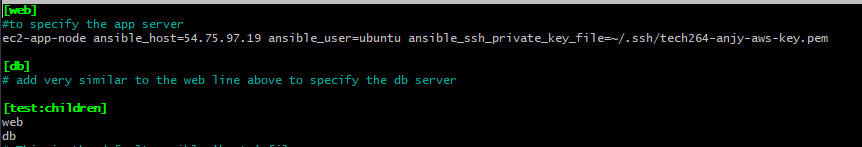
   3. ```ansible-inventory --graph``` to see your grouping and the layout
   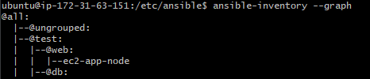

## Running ADHOC
4. to run ADHOC - to run a command on a machine that is hosted
5. ```ansible web -a "date"``` to run the date command on the vm under the [web] group
6. It'll return with the output from your target node vm

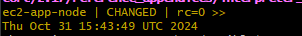

## Playbook - install nginx + config
1. in the controller vm
2. cd into the ansible folder ```/etc/ansible```
3. sudo nano and make a file ```sudo nano install_nginx.yaml```
4. a yaml file begins with 3 dashes and ends with 3 dots(you can do multiple yaml files within on if you use the "---" and "...")
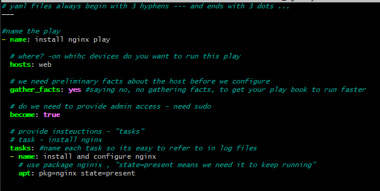
1. make it run using ```ansible-playbook install_nginx.yaml```
2. check on your target node that nginx is running 
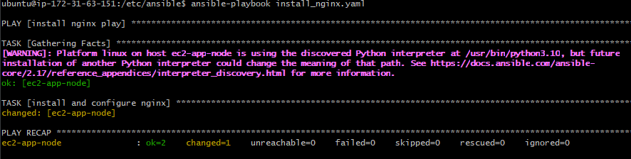

# Use ADHOC to copy to target node
An ADHOC cmd is a one off cmds using ansible 

```
ansible web -m ansible.builtin.copy -a "src=~/.ssh/tech264-anjy-aws-key.pem dest=~/.ssh/tech264-anjy-aws-key.pem mode=0400"
```
- the ``web`` to specify your group (or the specific host)
- use the ansible copy modules ```ansible.builtin.copy```
- specify what you want to copy and its path ```src=~/.ssh/tech264-anjy-aws-key.pem```
- specify path you want it to go and the name ```dest=~/.ssh/tech264-anjy-aws-key.pem```
- choose the permissions the file will have ```mode=0400```

# Use a copy module
1. create a new yaml file in your ansible folder (sudo nano)
2. name it "copy_test_file.yaml"

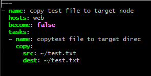

1. run the playbook ```ansible-playbook copy_test_file.yaml```
2. check your target node home direc


# Playbook - provision the APP VM
 **make sure to replace your target node public IP in the hosts file on your controller node if you restart your vms**

## To make your code more cloud agnostic 
1. use the command ```{{ ansible_user }}``` - different vms may have different username
2. use variables for your paths so it's easy to reference later in your script

## Using PM2 - for npm see further below
1. name the playbook "prov_app_with_npm_start.yaml"
2. we need to start up the playbook with a "---"
3. we reference our target node by referencing the group it's in "[web]"
4. we write yes to gather facts (though it might make the script run slower)
5. ```become: true``` means ypu can run your commands as super user

```
- name: run the app
  hosts: web
  gather_facts: yes
  become: true
```

### Task 1: install curl 
1. this will allow us to use the curl command when downloading the correct version of node js 
2. use the ansible built in apt 
3. and the state should be present - to keep it running
```
tasks:
  - name: install curl
    ansible.builtin.apt:
       update_cache: yes
       name: curl
       state: present
```
### Task 2: add the source for nodejs
1. use ansible's shell command
2. add the curl command (from your prov-app.sh)
```
  - name: add node source repo
    ansible.builtin.shell: curl -fsSL https://deb.nodesource.com/setup_20.x | sudo -E bash -
```
### Task 3: install and configure nodejs
1. use ansible's apt command
2. state: present - to keep the package running
3. if in home direc. no need for sudo
```
  - name: install and config node.js
    ansible.builtin.apt:
      name: nodejs
      state: present
```
### Task 4: download pm2 to run in background (for pm2 run)
1. use ansible's built in npm to download pm2
2. we want the it to work globally
3. state: present - we want it to keep running
4. requires sudo privileges
```
  - name: install pm2 globally
    ansible.builtin.npm:
     name: pm2
     global: true
     state: present
```
### Task 5: clone the app repo from github
1. we use the ansible git built in to clone the repo
2. the destination is the home direc and add the name you want the repo to have when you copy it
3. we want the version to be main
4. if cloning to home direc. - no need for sudo privileges 
```
  - name: clone the app folder from github to controller node
    ansible.builtin.git:
     repo: "https://github.com/N-AO5/tech264-sparta-app.git"
     dest: /home/ubuntu/repo
     version: main
```
### Task 6: install packages
1. use the community npm cmd
2. specify the path that you want this command to run
```
  - name: Install packages based on package.json.
    community.general.npm:
      path: /home/ubuntu/repo/app/
```
### Task 7: pm2 stop all and pm2 start
1. stop everything that could be running
2. start up the app
3. specify the location you want this cmd to run
4. shouldn't need sudo 
```
  - name: Start the application using pm2
    command: pm2 stop all
    args:
      chdir: /home/ubuntu/repo/app

 - name: Start the application using pm2
   command: pm2 start app.js
   args:
      chdir: /home/ubuntu/repo/app

```
## Complete NPM and PM2 scripts
[NPM script](npm-prov-app.yaml)
[PM2 script](pm2-prov-app.yaml)

# Playbook - provision the DB VM

1. name it "prov-db.yaml"
2. begin with the triple dashes
3. we want it to gather facts
4. we want to be super user
```
- name: install mongo db
  hosts: db
  gather_facts: yes
  become: true
```

### Task 1: Mongodb public key
1. we need the key to access mongo db
2. use the built in app key module
3. url - the url that the key is 
4. state present - we need it constantly
```
- name: Import the MongoDB public key
    ansible.builtin.apt_key:
      url: https://www.mongodb.org/static/pgp/server-7.0.asc
      state: present
```

### Task 2: Add Mongo DB repo
we need to add the repo for mongodb
```
  - name: Add the MongoDB repository
    ansible.builtin.apt_repository:
      repo: "deb [ arch=amd64,arm64 ] https://repo.mongodb.org/apt/ubuntu {{ ansible_distribution_release }}/mongodb-org/7.0 multiver>
      state: present
      update_cache: yes
```

### Task 3: installing Mongo DB
- This module downloads the mongodb but doesn't get it running unlike with nginx.
- whether the package runs or not straight after installation depends the package default.
- state: present - checks that the package is installed and present (for mongodb specifically).

 ```
  - name: Install MongoDB 7.0.6
    ansible.builtin.apt:
      name: mongodb-org=7.0.6
      state: present
      update_cache: yes
```

### Task 4: start and enable mongo db
- Needs to be started in the playbook after installing - unlike other packages ie nginx

```
  - name: Ensure MongoDB is enabled and started
    ansible.builtin.service:
      name: mongod
      enabled: yes
```


### Task 5: change the Bind IP in the mongodb config file

```
 - name: update bind IP using lineinfile module
    ansible.builtin.lineinfile:
      path: "/etc/mongod.conf"
      search_string: '127.0.0.1'
      line: "  bindIp: 0.0.0.0"
      state: present
```
### Task 6: start and enable mongodb again
```
  - name: Ensure MongoDB is enabled and started
    ansible.builtin.service:
      name: mongod
      enabled: yes
      state: started
```
## Trouble shooting
1. check that mongodb is running - **run this adhoc command to check that mongodb is running ```ansible db -a "sudo systemctl status mongod"```**
2. check that the bindip had been configured - 
**run this adhoc command to check your bind ip ```ansible db -a "cat /etc/mongod.conf"```** or **```ansible db  -a "grep 'bindIp' /etc/mongod.conf```**
3. check if multiple processes are running in the background ```ps aux```, use kill to stop them

# Create a master playbook
This will run both playbooks for you, make sure to put them in order that you want them to run (ie. db first)
1. create the yaml file - ```sudo nano master_playbook```
2. name the db first - so it runs that playbook first 
3. use the command ```import_playbook``
4. do the app vm next

```
---
name: DB provisions playbook
import_playbook: prov_db.yaml

name: App provisions playbook
import_playbook: prov_app_with_npm_start.yaml
```
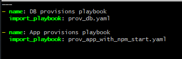