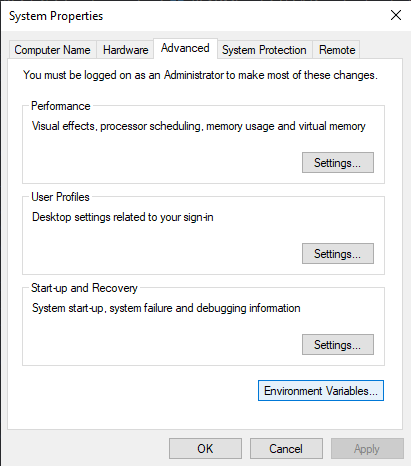
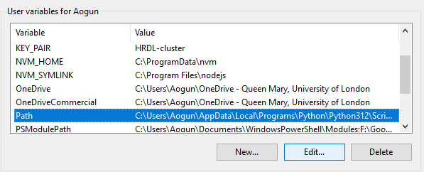
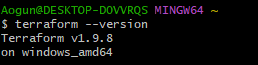
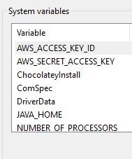

# Table of contents
- [Table of contents](#table-of-contents)
- [Download and add terraform into PATH env. var.](#download-and-add-terraform-into-path-env-var)
- [Set-up Env. Var. for AWS](#set-up-env-var-for-aws)
- [Research Terraform](#research-terraform)
  - [What is Terraform? What is it used for?](#what-is-terraform-what-is-it-used-for)
  - [Why use Terraform? The benefits?](#why-use-terraform-the-benefits)
  - [Alternatives to Terraform](#alternatives-to-terraform)
  - [Who is using Terraform in the industry?](#who-is-using-terraform-in-the-industry)
  - [In IaC, what is orchestration? How does Terraform act as "orchestrator"?](#in-iac-what-is-orchestration-how-does-terraform-act-as-orchestrator)
  - [Best practice supplying AWS credentials to Terraform](#best-practice-supplying-aws-credentials-to-terraform)
    - [If Terraform needs AWS access, there are different options on supplying the AWS credentials to Terraform. What is order in which Terraform looks up AWS credentials (which ways take precedence/priority)?](#if-terraform-needs-aws-access-there-are-different-options-on-supplying-the-aws-credentials-to-terraform-what-is-order-in-which-terraform-looks-up-aws-credentials-which-ways-take-precedencepriority)
    - [What is best practice to supply AWS credentials?](#what-is-best-practice-to-supply-aws-credentials)
    - [How should AWS credentials never be passed to Terraform?](#how-should-aws-credentials-never-be-passed-to-terraform)
- [Why use Terraform for different environments (e.g. production, testing, etc)](#why-use-terraform-for-different-environments-eg-production-testing-etc)

# Download and add terraform into PATH env. var.
1. download the latest version of terraform
2. place that unzipped file into a logical place in your C drive eg. "C:\my-cmd-line-tools\terraform"
3. search edit system environment variables on your computer search bar
4. select env. var. in the advanced tab

5. in user environment variables, scroll to path and edit
 

6. add the path to your env. var. and press ok
7. you should be able to check your terraform version from anywhere in your system 

# Set-up Env. Var. for AWS

1. Follow the instructions above but go to system
    

2. add the two variables for your access key id and the aws secret key.

# Research Terraform

## What is Terraform? What is it used for?
**Primarily for orchestration tool used to provision infrastructure**

- Terraform is an open-source Infrastructure as Code (IaC) tool created by HashiCorp. 

- It allows you to define, create, deploys and manage infrastructure resources such as virtual machines, storage, networking, and more across multiple cloud platforms  and on-premises environments using declarative configuration files.

- Terraform sees infrastructure as immutable, meaning it can destroy and create as needed.

- Uses Hashicorp configuration language (HCL) which can be seamlessly converted to JSON

## Why use Terraform? The benefits?

- Consistency and Repeatability: Ensures that infrastructure is deployed in the same way every time, eliminating configuration drift.

- Version Control: Infrastructure code can be stored in repositories, allowing teams to track changes and roll back to previous versions if necessary.

- Multi-Cloud Support: Simplifies managing infrastructure across multiple cloud providers using a consistent language.

- Cloud agnostic: Uses different providers, each provider maintains their own plug-ins that will allow us to interface with the API of that particular provider.

- Automation: Reduces the need for manual provisioning, making it easier to manage complex, scalable infrastructures efficiently.

- Collaboration: Multiple teams can collaborate on infrastructure code, using version-controlled repositories to make changes.

- Declarative: You define the desired state of your infrastructure (e.g., "I want 3 instances running"), and the IaC tool figures out how to achieve that.

- Open source: Can be used for free commercial by businesses but can't use their code to compete against them.

- Easy to use

## Alternatives to Terraform
- AWS CloudFormation
- Pulumi
- Ansible
- Chef
- SaltStack
- Google Cloud Deployment Manager
- Azure Resource Manager (ARM) Templates
- Red Hat OpenShift (Helm for Kubernetes)
- Crossplane
- Spacelift

## Who is using Terraform in the industry?
1. **Netflix**
2. **Airbnb**
3. **Uber**
4. **Adobe**
5. **GitHub**
6. **Slack**
7. **Lyft**
8. **Expedia**
9.  **Spotify**
10. **Salesforce**
11. **Coca-Cola**
12. **Samsung**
13. **Financial Times**

## In IaC, what is orchestration? How does Terraform act as "orchestrator"?
Orchestration in Infrastructure as Code (IaC) refers to the automated arrangement, coordination, and management of complex infrastructure tasks, including provisioning, configuration, and lifecycle management of resources across multiple systems. It involves organizing the deployment of interdependent resources (e.g., databases, servers, networks) in the correct order and ensuring they interact as intended. Orchestration tools automate the entire process, from creating the infrastructure to managing interdependencies between services.

How Does Terraform Act as an "Orchestrator"?

Terraform acts as an orchestrator in the following ways:

1. **Dependency Management**:
   - Terraform automatically determines the order in which resources need to be created, updated, or destroyed based on their dependencies. For example, if a virtual machine depends on a network, Terraform will create the network first before provisioning the virtual machine.
   
2. **Infrastructure State Tracking**:
   - Terraform maintains a **state file** that tracks the current state of infrastructure. This state helps Terraform know what resources exist, what needs to be updated, and what dependencies exist, allowing it to orchestrate infrastructure changes efficiently.

3. **Automated Workflow**:
   - Terraform automates the full workflow of creating, updating, and managing infrastructure. It applies changes only when needed, ensuring minimal disruption and high efficiency.
   
4. **Multi-Cloud and Multi-Service Coordination**:
   - Terraform can orchestrate resources across multiple cloud providers (AWS, Azure, Google Cloud), private clouds, and on-premises systems. It ensures that resources from different environments can work together in a coordinated way.
   
5. **Declarative Syntax**:
   - In Terraform, users declare the desired state of the infrastructure, and Terraform orchestrates the creation and management of those resources to match the desired state. It handles the complexity of ensuring resources are created, modified, or destroyed as needed.

6. **Modular Infrastructure**:
   - Terraform allows the use of reusable modules, enabling organizations to define complex infrastructure blueprints. Terraform then orchestrates the deployment and management of these modules consistently across environments.

## Best practice supplying AWS credentials to Terraform

- Prefer IAM roles for running Terraform on AWS resources.
- Use environment variables or the AWS credentials file for local development.
- Use secrets management tools (like AWS Secrets Manager) in production environments.
- Never hard-code AWS credentials in your Terraform configuration.
- Ensure IAM policies are as restrictive as possible.

### If Terraform needs AWS access, there are different options on supplying the AWS credentials to Terraform. What is order in which Terraform looks up AWS credentials (which ways take precedence/priority)?
Terraform starts with searching for the specific env. var., if no environment variables are found, Terraform looks for credentials explicitly defined in the aws provider block.
The other ways it may look are as follows:
1. Shared Credentials File (~/.aws/credentials)
2. AWS CLI Config File (~/.aws/config)
3. EC2 Instance Metadata (IAM Role)
4. Web Identity Tokens (for Kubernetes)
5. External Credential Management Tools (e.g., AWS Vault)

### What is best practice to supply AWS credentials? 
1. Use IAM Roles for AWS Resources (Preferred Method)
2. Use Environment Variables (Local and CI/CD)
3. Use AWS Credentials File
4. Use AWS Secrets Manager or Parameter Store
5. Use Terraform Cloud/Enterprise Secrets Management

###  How should AWS credentials never be passed to Terraform?
- **Never Hard-Code AWS Credentials in Terraform Files**
- Never Commit Credentials to Version Control
- Avoid Embedding Credentials in CI/CD Pipeline Configurations

# Why use Terraform for different environments (e.g. production, testing, etc)
- Consistency across environments. (developers may use different environments to develop and test their code, terraform matches their environment like dependencies (packages, versions etc) only difference could be like scalability for load in production environment)

- Reusability of code and infrastructure components.

- Isolation of environments for safe testing and deployment.

- Automation of environment provisioning and updates.

- Version control and drift detection for infrastructure changes.

- Cost efficiency through automated resource lifecycle management.

