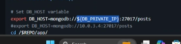

Install terraform in your own machines

Test with terraform --version Output should be similar to:

terraform --version
Terraform v1.6.4
on windows_amd64
Make sure you can run terraform command from anywhere in a Git Bash window

Move the terraform.exe to a logical place e.g. 
- C:\Hashicorp\Terraform
- Add the location to the PATH env var
- ☝️ Recommended: To make things easier in the future, you may wish to setup a shared folder for all your command line tools in a logical location. For example:
  - Create the folder C:\my-cmd-line-tools
  - Add C:\my-cmd-line-tools to the PATH env var
  - Add terraform.exe (and any future command line tools) to this folder

- Add the Terraform extension/plugin (official one by Hashicorp) to VSCode

- Create a new folder/repo for Terraform documentation

- Create a new repo for storing terraform code, name is similar to tech264-terraform

- Share your terraform version output in the chat as soon as you have your terraform command working from anywhere

Document everything done above

Research Terraform:

What is Terraform? What is it used for?
Why use Terraform? The benefits?
Alternatives to Terraform
Who is using Terraform in the industry?
In IaC, what is orchestration? How does Terraform act as "orchestrator"?
Best practice supplying AWS credentials to Terraform
If Terraform needs AWS access, there are different options on supplying the AWS credentials to Terraform. What is order in which Terraform looks up AWS credentials (which ways take precedence/priority)?
What is best practice to supply AWS credentials? Include: How should AWS credentials never be passed to Terraform?
Why use Terraform for different environments (e.g. production, testing, etc)
Share your terraform version output in the chat as soon as you have your terraform command working from anywhere

