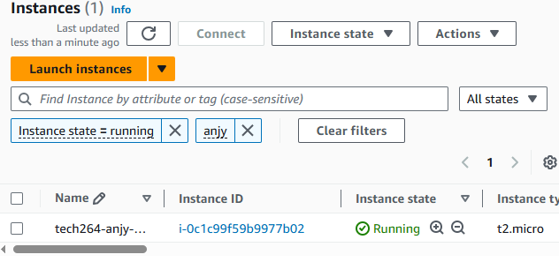

# Table of contents
- [Table of contents](#table-of-contents)
- [Research Terraform](#research-terraform)
  - [What is Terraform? What is it used for?](#what-is-terraform-what-is-it-used-for)
  - [Why use Terraform? The benefits?](#why-use-terraform-the-benefits)
  - [Alternatives to Terraform](#alternatives-to-terraform)
  - [Who is using Terraform in the industry?](#who-is-using-terraform-in-the-industry)
  - [In IaC, what is orchestration? How does Terraform act as "orchestrator"?](#in-iac-what-is-orchestration-how-does-terraform-act-as-orchestrator)
  - [Best practice supplying AWS credentials to Terraform](#best-practice-supplying-aws-credentials-to-terraform)
    - [If Terraform needs AWS access, there are different options on supplying the AWS credentials to Terraform. What is order in which Terraform looks up AWS credentials (which ways take precedence/priority)?](#if-terraform-needs-aws-access-there-are-different-options-on-supplying-the-aws-credentials-to-terraform-what-is-order-in-which-terraform-looks-up-aws-credentials-which-ways-take-precedencepriority)
    - [What is best practice to supply AWS credentials?](#what-is-best-practice-to-supply-aws-credentials)
    - [How should AWS credentials never be passed to Terraform?](#how-should-aws-credentials-never-be-passed-to-terraform)
  - [Why use Terraform for different environments (e.g. production, testing, etc)](#why-use-terraform-for-different-environments-eg-production-testing-etc)
  - [What is pull and push configuration management (IaC)?](#what-is-pull-and-push-configuration-management-iac)
    - [Which tools support push/pull?](#which-tools-support-pushpull)
    - [Does Terraform use the push or pull configuration?](#does-terraform-use-the-push-or-pull-configuration)
    - [Which is better: push or pull configuration management?](#which-is-better-push-or-pull-configuration-management)
  - [Environments](#environments)
- [Download and add terraform into PATH env. var.](#download-and-add-terraform-into-path-env-var)
- [Set-up Env. Var. for AWS](#set-up-env-var-for-aws)
- [Terraform diagram](#terraform-diagram)
- [Terraform Code folder](#terraform-code-folder)
  - [Create a .gitignore files](#create-a-gitignore-files)
    - [IF YOU'VE ALREADY PUSHED SENSITIVE INFORMATION](#if-youve-already-pushed-sensitive-information)
  - [Create a main.tf folder to get a AWS instance running](#create-a-maintf-folder-to-get-a-aws-instance-running)
    - [TO DESTROY:](#to-destroy)
  - [Create an AWS Security Group](#create-an-aws-security-group)
  - [Add your key pair \& security to the instance resource block](#add-your-key-pair--security-to-the-instance-resource-block)
  - [Adding variables](#adding-variables)
- [Use Terraform to create a repo on GitHub](#use-terraform-to-create-a-repo-on-github)
- [Use Terraform to create a 2-tier deployment on Azure](#use-terraform-to-create-a-2-tier-deployment-on-azure)
  - [Create a main.tf file](#create-a-maintf-file)


# Research Terraform

## What is Terraform? What is it used for?
**Primarily for orchestration tool used to provision infrastructure**

- Terraform is an open-source Infrastructure as Code (IaC) tool created by HashiCorp. 

- It allows you to define, create, deploys and manage infrastructure resources such as virtual machines, storage, networking, and more across multiple cloud platforms  and on-premises environments using declarative configuration files.

- Terraform sees infrastructure as immutable, meaning it can destroy and create as needed.

- Uses Hashicorp configuration language (HCL) which can be seamlessly converted to JSON


## Why use Terraform? The benefits?

- Consistency and Repeatability: Ensures that infrastructure is deployed in the same way every time, eliminating configuration drift.

- Version Control: Infrastructure code can be stored in repositories, allowing teams to track changes and roll back to previous versions if necessary.

- Multi-Cloud Support: Simplifies managing infrastructure across multiple cloud providers using a consistent language.

- Cloud agnostic: Uses different providers, each provider maintains their own plug-ins that will allow us to interface with the API of that particular provider.

- Automation: Reduces the need for manual provisioning, making it easier to manage complex, scalable infrastructures efficiently.

- Collaboration: Multiple teams can collaborate on infrastructure code, using version-controlled repositories to make changes.

- Declarative: You define the desired state of your infrastructure (e.g., "I want 3 instances running"), and the IaC tool figures out how to achieve that.

- Open source: Can be used for free commercial by businesses but can't use their code to compete against them.

- Easy to use

## Alternatives to Terraform
- AWS CloudFormation
- Pulumi
- Ansible
- Chef
- SaltStack
- Google Cloud Deployment Manager
- Azure Resource Manager (ARM) Templates
- Red Hat OpenShift (Helm for Kubernetes)
- Crossplane
- Spacelift

## Who is using Terraform in the industry?
1. **Netflix**
2. **Airbnb**
3. **Uber**
4. **Adobe**
5. **GitHub**
6. **Slack**
7. **Lyft**
8. **Expedia**
9.  **Spotify**
10. **Salesforce**
11. **Coca-Cola**
12. **Samsung**
13. **Financial Times**

## In IaC, what is orchestration? How does Terraform act as "orchestrator"?
Orchestration in Infrastructure as Code (IaC) refers to the automated arrangement, coordination, and management of complex infrastructure tasks, including provisioning, configuration, and lifecycle management of resources across multiple systems. It involves organizing the deployment of interdependent resources (e.g., databases, servers, networks) in the correct order and ensuring they interact as intended. Orchestration tools automate the entire process, from creating the infrastructure to managing interdependencies between services.

How Does Terraform Act as an "Orchestrator"?

Terraform acts as an orchestrator in the following ways:

1. **Dependency Management**:
   - Terraform automatically determines the order in which resources need to be created, updated, or destroyed based on their dependencies. For example, if a virtual machine depends on a network, Terraform will create the network first before provisioning the virtual machine.
   
2. **Infrastructure State Tracking**:
   - Terraform maintains a **state file** that tracks the current state of infrastructure. This state helps Terraform know what resources exist, what needs to be updated, and what dependencies exist, allowing it to orchestrate infrastructure changes efficiently.

3. **Automated Workflow**:
   - Terraform automates the full workflow of creating, updating, and managing infrastructure. It applies changes only when needed, ensuring minimal disruption and high efficiency.
   
4. **Multi-Cloud and Multi-Service Coordination**:
   - Terraform can orchestrate resources across multiple cloud providers (AWS, Azure, Google Cloud), private clouds, and on-premises systems. It ensures that resources from different environments can work together in a coordinated way.
   
5. **Declarative Syntax**:
   - In Terraform, users declare the desired state of the infrastructure, and Terraform orchestrates the creation and management of those resources to match the desired state. It handles the complexity of ensuring resources are created, modified, or destroyed as needed.

6. **Modular Infrastructure**:
   - Terraform allows the use of reusable modules, enabling organizations to define complex infrastructure blueprints. Terraform then orchestrates the deployment and management of these modules consistently across environments.


## Best practice supplying AWS credentials to Terraform

- Prefer IAM roles for running Terraform on AWS resources.
- Use environment variables or the AWS credentials file for local development.
- Use secrets management tools (like AWS Secrets Manager) in production environments.
- Never hard-code AWS credentials in your Terraform configuration.
- Ensure IAM policies are as restrictive as possible.

### If Terraform needs AWS access, there are different options on supplying the AWS credentials to Terraform. What is order in which Terraform looks up AWS credentials (which ways take precedence/priority)?
Terraform starts with searching for the specific env. var., if no environment variables are found, Terraform looks for credentials explicitly defined in the aws provider block.
The other ways it may look are as follows:
1. Shared Credentials File (~/.aws/credentials)
2. AWS CLI Config File (~/.aws/config)
3. EC2 Instance Metadata (IAM Role)
4. Web Identity Tokens (for Kubernetes)
5. External Credential Management Tools (e.g., AWS Vault)

### What is best practice to supply AWS credentials? 
1. Use IAM Roles for AWS Resources (Preferred Method)
2. Use Environment Variables (Local and CI/CD)
3. Use AWS Credentials File
4. Use AWS Secrets Manager or Parameter Store
5. Use Terraform Cloud/Enterprise Secrets Management

###  How should AWS credentials never be passed to Terraform?
- **Never Hard-Code AWS Credentials in Terraform Files**
- Never Commit Credentials to Version Control
- Avoid Embedding Credentials in CI/CD Pipeline Configurations

## Why use Terraform for different environments (e.g. production, testing, etc)

- Consistency across environments. (developers may use different environments to develop and test their code).
  
- Terraform matches their environment like dependencies (packages, versions, architecture etc).

- Difference could be like scalability for load in production environment vs testing environment

- Reusability of code and infrastructure components.

- Isolation of environments for safe testing and deployment.

- Automation of environment provisioning and updates.

- Version control and drift detection for infrastructure changes.

- Cost efficiency through automated resource lifecycle management.


## What is pull and push configuration management (IaC)?
**Pull Config.**
- In pull configuration, the nodes (servers) regularly request or "pull" configuration updates from a central configuration server.

- Each node independently checks for updates and applies the configuration as needed.

- The central server maintains the desired state (how you want your infrastructure or system to be configured) of the infrastructure, and nodes compare their current state (the actual state of your infrastructure or system at any given moment) to this desired state.

**Push Config.**
- In push configuration, the central server or an administrator actively pushes the configuration changes to the nodes.

- The process is immediate, and the central system applies changes directly to the targeted infrastructure.

### Which tools support push/pull?
Pull - Puppet & Chef
Push - Ansible & terraform

### Does Terraform use the push or pull configuration?
Terraform typically operates as a push-based tool. When running terraform apply, Terraform pushes the changes directly to cloud providers (e.g., AWS, Azure, GCP) to provision or manage resources.

Terraform is a little different to a typical push config. in that it "talks" to APIs first which then talks to the devices.

### Which is better: push or pull configuration management?
***Pull configuration*** is better for large, distributed, and scalable environments where nodes need to operate independently and pull updates as needed.

***Push configuration*** is better for smaller, controlled environments or situations where immediate updates are necessary.

## Environments

Environments can be separated byt using a different variables.tf files for each environment - only one main.tf, multiple variable files, one folder

you can also make a workspace within the main.tf as specify the environment you're referencing for each part

---
<br>


# Download and add terraform into PATH env. var.
1. download the latest version of terraform
2. place that unzipped file into a logical place in your C drive eg. "C:\my-cmd-line-tools\terraform"
3. search edit system environment variables on your computer search bar
4. select env. var. in the advanced tab


5. in user environment variables, scroll to path and edit
 


6. add the path to your env. var. and press ok
7. you should be able to check your terraform version from anywhere in your system 


# Set-up Env. Var. for AWS

1. Follow the instructions above but go to system
    


2. add the two variables for your access key id and the aws secret key.

# Terraform diagram 


# Terraform Code folder

## Create a .gitignore files
- No sensitive files - just used to avoid bloat in remote repos ```.terraform/```

- state files contains sensitive information and credentials used by terraform - Never (even when collaborating) share these files on git repos
```terraform.tfstate```
```terraform.tfstate.backup```

- Variable files contain the variables we set for our terraform scripts- some of the values we may not want to share (* means ignore anything)
```*.tfvars```
```*.auto.tfvars```
```variables.tf```


- override files - used to override the default values of the variables in the terraform scripts
```override.tf```
```override.tf.json```

ALSO 

No sensitive info - no need to be git ignored 
- Locks the provider version and the plug-ins associated so other users can use the same version and their code wont break
```.terraform.lock.hcl```

### IF YOU'VE ALREADY PUSHED SENSITIVE INFORMATION
- Delete the public repo immediately or make the repo private
- delete the .git folder and reinitialize the repo locally
- Can use ```git filter-branch```
- Can also use ```git rm --cached .gitignore``` to remove history

## Create a main.tf folder to get a AWS instance running

1. We need to give it a set of instructions - do NOT include your AWS access keys!

```
# Create an ec2 instance
# Where to create - provider

# Which services/resources to create

# Which AMI (Amazon Machine Image) ID - AMI ID ami-0c1c30571d2dae5c9 (for ubuntu 22.04 lts)

# What type of instance - t2.micro

# Add a public IP to this instance

# Add a name to the service/ resource we create

# syntax often used in HCL is KEY = VALUE
```

2. add a block to select a provider and region
```
# Where to create - provider
provider "aws" {     # this is a block - you can have blocks within blocks
  # Which region on aws
  region = "eu-west-1" # when we do a terraform init- it will know which provider 
}
```
3. navigate into the repo that contains your main.tf and run a ```terraform init`` command


1. go back to your vscode and add your resource block to create your aws instance (can use ```terraform fmt``` in your bash window to fix formatting)

```
# Which services/resources to create - "aws_instance" means youre telling terraform to make an instance 
resource "aws_instance" "app_instance" { # the "app_instance" is how you'll reference the instance within our code
  # Which AMI (Amazon Machine Image) ID (for ubuntu 22.04 lts)
  ami = "ami-0c1c30571d2dae5c9"
  # What type of instance - t2.micro
  instance_type = "t2.micro"
  # Add a public IP to this instance - boolean value true as we want to associate a public ip
  associate_public_ip_address = true
  # Add a name to the service/ resource we create
  tags = {
    Name = "tech264-anjy-tf-app-instance"
  }
}
```

5. save and go to bash and run the command ```terraform plan```
6. terraform will give a colour coded list of what it will create and destroy


1. ``` -out``` option can be used used to save the plan (useful for ci/cd pipelines)
2. ``` terraform apply``` recreates the plan and then asks for confirmation - anything but yes will cancel the actions. This command is potentially destructive, the plan cmd allows you to double check (safely) what you intend to do.


1. type "yes" and create your instance 


1.   check AWS website and your instance has been created



### TO DESTROY:

``` terraform destroy```

  

then type yes to confirm then it will destroy


## Create an AWS Security Group
Using Terraform and Terraform official documentation:

- In your Create an AWS security group
  - Allow port 22 from localhost
  - Allow port 3000 from all
  - Allow port 80 from all

1. Create a security group resource
2. include all the ports you want to allow in
3. and make sure it allows outbound connection too

```
resource "aws_security_group" "tech264_anjy_security_group" {
  name        = "tech264-anjy-tf-allow-port-22-3000-80"
  description = "Allow inbound traffic on port 22, 3000 and 80"

  # Allow SSH (port 22) from localhost (replace with your public IP)
  ingress {
    from_port   = 22
    to_port     = 22
    protocol    = "tcp"
    cidr_blocks = ["0.0.0.0/0"]
  }

  # Allow port 3000 for MONGDB from all IP addresses
  ingress {
    from_port   = 3000
    to_port     = 3000
    protocol    = "tcp"
    cidr_blocks = ["0.0.0.0/0"]
  }


  # Allow HTTP (port 80) from all IP addresses
  ingress {
    from_port   = 80
    to_port     = 80
    protocol    = "tcp"
    cidr_blocks = ["0.0.0.0/0"]
  }

  # Allow all outgoing traffic
  egress {
    from_port   = 0
    to_port     = 0
    protocol    = "-1" # -1 means all protocols
    cidr_blocks = ["0.0.0.0/0"]
  }

  tags = {
    Name = "tech264-anjy-tf-allow-port-22-3000-80"
  }
}
```
## Add your key pair & security to the instance resource block
- Add your key pair and reference the key (aws.pem) that was made previously
- add the security group you'd like your instance to be associated with 

```
key_name = "tech264-anjy-aws-key"
 # Add a security group to this instance
vpc_security_group_ids=[aws_security_group.tech264_anjy_security_group.id]
```
## Adding variables 
1. Create a new terraform file for your variables "variables.tf"
2. The file must be in the same folder as your main.tf in order for them to be able to reference each other
3. format your variables like belows (description is optional)

```
variable "app_ami_id" {
  description = "The AMI ID for the AWS app instance"
  default     = "ami-0c1c30571d2dae5c9"
}
```
1. in the main.tf file reference your variable by typing "var." followed by your variable name 


# Use Terraform to create a repo on GitHub

1. Create a folder for your main.tf file and at a provider block to reference github as well as a resource block to create a repo
```
# Set the GitHub provider
provider "github" {
  token = var.GITHUB_TOKEN
}

# Create a new GitHub repository
resource "github_repository" "new_repo" {
  name        = "Tech264-anjy-tf-create-github-repo"
  description = "Repo created using terraform"
  visibility  = "public"  
}

```
2. create a variable.tf to reference the github token
``` 
variable "GITHUB_TOKEN" {
  description = "The GitHub token to authenticate with the GitHub API"
  type        = string
  sensitive   = true
}

```
3. go to github -> settings -> developer settings -> personal access tokens
4. create a new token and select repo as the scope
5. You may also allow the token to destroy your repo within the scope


1. go to your system properties -> env. var.
2. add your Github_token to your system and name it like so:


7. make sure to add the "TF_VAR" so that terraform is able to find it when it is referenced in your main.tf file
8. create a git ignore and include state files
9. cd into the repo on git bash
10.  do a terraform init & apply
11.  your repo should appear!

# Use Terraform to create a 2-tier deployment on Azure

1. Download Azure CLI and put it in my "my_cmd_line_tools" repo
2. create a Environment variable for az cli in your PATH
  
1. Edit PATH and add the location of the app file
  
1. go to your terminal and "az login"
2. A pop up will allow you to log into your microsoft account
3. select the resource group (or just press enter as there is only one)
4. Create a repo for the terraform files we want to create - "tech264-2-tier-app-deployment"
## Create a main.tf file 
we need to:
1. state the provider
```
provider "azurerm" { 
 use_cli = true #tells terraform to use cli for authentication
 subscription_id = "cd36dfff-6e85-4164-b64e-b4078a773259"
 resource_provider_registrations = "none"
 features {}
}
```
1. create a public IP
```
resource "azurerm_public_ip" "app_public_ip" {
 name                = "anjy-app-public-ip"
 resource_group_name = "tech264" 
 location            = "UK South"
 allocation_method   = "Static"     
}
```
1. create a Virtual Network
```
 resource "azurerm_virtual_network" "vnet" {
   name                = "tech264-anjy-VNet"
   address_space       = ["10.0.0.0/16"]
   location            = "UK South"
   resource_group_name = "tech264"
 }
```

1. create a public subnet
```
resource "azurerm_subnet" "app_subnet" {
 name                 = "app-subnet"
 resource_group_name  = "tech264"
 virtual_network_name = azurerm_virtual_network.vnet.name
 address_prefixes     = ["10.0.1.0/24"]
}
```
1. specify the NSG  rules for the public subnet - allow SSH, HTTP and port 3000 (nginx?)
```
resource "azurerm_network_security_group" "app_nsg" {
   name                = "appNSG"
   location            = "UK South"
   resource_group_name = "tech264"


 # NSG rules to allow SSH 
   security_rule {
     name                       = "allow_ssh"
     priority                   = 1001
     direction                  = "Inbound"
     access                     = "Allow"
     protocol                   = "Tcp"
     source_port_range          = "*"
     destination_port_range     = "22"
     source_address_prefix      = "*"
     destination_address_prefix = "*"
   }
 # NSG rules to allow HTTP
   security_rule {
     name                       = "allow_http"
     priority                   = 1002
     direction                  = "Inbound"
     access                     = "Allow"
     protocol                   = "Tcp"
     source_port_range          = "*"
     destination_port_range     = "80"
     source_address_prefix      = "*"
     destination_address_prefix = "*"
   }
 # NSG rules to allow port 3000
   security_rule {
     name                       = "allow_port_3000"
     priority                   = 1003
     direction                  = "Inbound"
     access                     = "Allow"
     protocol                   = "Tcp"
     source_port_range          = "*"
     destination_port_range     = "3000"
     source_address_prefix      = "*"
     destination_address_prefix = "*"
   }
 }
```
6. create a private subnet
```
resource "azurerm_subnet" "db_subnet" {
 name                 = "db-subnet"
 resource_group_name  = "tech264"
 virtual_network_name = azurerm_virtual_network.vnet.name
 address_prefixes     = ["10.0.2.0/24"]
}  
```
7. specify the NSG rules for the db subnet - allow SHH, allow Mongo DB, deny anything else
```
 # Specify the NSG rules for the DB subnet
 resource "azurerm_network_security_group" "db_nsg" {
   name                = "db_NSG"
   location            = "UK South"
   resource_group_name = "tech264"

   security_rule {
     name                       = "allow_ssh"
     priority                   = 1001
     direction                  = "Inbound"
     access                     = "Allow"
     protocol                   = "Tcp"
     source_port_range          = "*"
     destination_port_range     = "22"
     source_address_prefix      = "*"
     destination_address_prefix = "*"
   }

   security_rule {
     name                       = "allow_mongo"
     priority                   = 1002
     direction                  = "Inbound"
     access                     = "Allow"
     protocol                   = "Tcp"
     source_port_range          = "*"
     destination_port_range     = "27017"
     source_address_prefix      = "10.0.1.0/24"
     destination_address_prefix = "*"
   }

   security_rule {
     name                       = "deny_all"
     priority                   = 4096
     direction                  = "Inbound"
     access                     = "Deny"
     protocol                   = "*"
     source_port_range          = "*"
     destination_port_range     = "*"
     source_address_prefix      = "*"
     destination_address_prefix = "*"
   }
 } 
```
8. create a network interface for the app vm
```
 resource "azurerm_network_interface" "app_nic" {
   name                = "appNIC"
   location            = "UK South"
   resource_group_name = "tech264"

   ip_configuration {
     name                          = "internal"
     subnet_id                     = azurerm_subnet.app_subnet.id
     private_ip_address_allocation = "Dynamic"
     public_ip_address_id          = azurerm_public_ip.app_public_ip.id
   }
 }
```
9.  Associate the network security group with the network interface for the app
```
 resource "azurerm_network_interface_security_group_association" "app_nic_nsg_assoc" {
   network_interface_id      = azurerm_network_interface.app_nic.id
   network_security_group_id = azurerm_network_security_group.app_nsg.id
 }
```
10.  create a network interface for the db vm
```
 resource "azurerm_network_interface" "db_nic" {
     name                = "dbNIC"
   location            = "UK South"
   resource_group_name = "tech264"

   ip_configuration {
     name                          = "internal"
     subnet_id                     = azurerm_subnet.db_subnet.id
     private_ip_address_allocation = "Dynamic"
   }
 }
```
11.  create the app vm - add user data and the ssh key
```
   resource "azurerm_linux_virtual_machine" "app_vm" {
   name                = "tech264-anjy-tf-app-vm"
     location            = "UK South"
     resource_group_name = "tech264"
     size                = "Standard_B1s"
     admin_username      = "adminuser"
     network_interface_ids = [azurerm_network_interface.app_nic.id]
     disable_password_authentication = true
     os_disk {
       caching              = "ReadWrite"
       storage_account_type = "Standard_LRS"
     }
     source_image_id = "/subscriptions/cd36dfff-6e85-4164-b64e-b4078a773259/resourceGroups/tech264/providers/Microsoft.Compute/images/tech264-anjy-ready-to-run-app-image"

   # Add my user data
   user_data = base64encode(file("~/Documents/Sparta Global/github/tech264-cloud-linux/linux/Linux_code_along/BASH_scripts/run-app-only.sh"))

   # Add an ssh key to the app vm
   admin_ssh_key {
       username   = "adminuser"
       public_key = file("~/.ssh/tech264-anjy-az-key.pub")
     }
```
12.  create the db vm - add user data and the ssh key
```
 resource "azurerm_linux_virtual_machine" "db_vm" {
 name                = "tech264-anjy-tf-db-vm"
 location            = "UK South"
 resource_group_name = "tech264"
 size                = "Standard_B1s"
 admin_username      = "adminuser"
 network_interface_ids = [azurerm_network_interface.db_nic.id]
 os_disk {
   caching              = "ReadWrite"
   storage_account_type = "Standard_LRS"
 }
admin_ssh_key {
   username   = "adminuser"
   public_key = file("~/.ssh/tech264-anjy-az-key.pub")
}
 source_image_id = "/subscriptions/cd36dfff-6e85-4164-b64e-b4078a773259/resourceGroups/tech264/providers/Microsoft.Compute/images/tech264-anjy-ready-to-run-db-image"

}
```
13. Associate the network security group with the network interface for the app  
 
```
 resource "azurerm_network_interface_security_group_association" "db_nic_nsg_assoc" {
   network_interface_id      = azurerm_network_interface.db_nic.id
   network_security_group_id = azurerm_network_security_group.db_nsg.id
 }
```
13. make sure the app creation depends on the db creation

```
# Make sure the db is made first - app vm depends on db vm
depends_on = [azurerm_linux_virtual_machine.db_vm]
}
```

4. create a .gitignore and add the relevant files
5. create a variables.tf and make the variables that repeated into variables in that folder
6. in the bash terminal, cd into the repo created "tech264-2-tier-app-deployment"
7. do a terraform init
8. do a terraform plan
9. do a terraform apply 
10. check azure for your vms 
11. go to the app vm IP address / posts
12. the app should be working!


